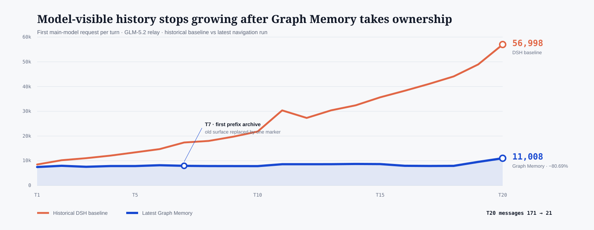

# DSH context-takeover benchmark

<p align="center">
  
</p>

This public benchmark measures two different questions separately:

1. **Context ownership:** how many tokens and messages reach the first main-model request of each turn?
2. **Real bill:** how many tokens are used by every main-model request, Graph Memory extraction, and embeddings?

The 20-turn scenario is a synthetic continuous-development task. It deliberately changes previously established facts so that a memory system must preserve the newest value and mark old values as revoked.

## Published V73 navigation result

| Metric | Historical DSH baseline | Latest Graph Memory | Change |
|---|---:|---:|---:|
| First-request tokens, T01–T20 | 532,451 | 165,896 | **−68.84%** |
| First-request tokens, T20 | 56,998 | 11,008 | **−80.69%** |
| First-request messages, T20 | 171 | 21 | **−87.72%** |
| Main-agent tokens, all requests | 2,487,776 | 2,291,077 | −7.91% |
| All LLM tokens, including GM extraction | 2,487,776 | 2,324,219 | −6.57% |
| All measured tokens, including embeddings | 2,487,776 | 2,327,728 | −6.43% |

The latest Graph Memory arm made 166 main-model requests, 20 extraction requests, and 41 embedding requests; the historical baseline made 77 main-model requests. The user requested a GM-only rerun, so the baseline and candidate use different DSH commits and are not a strict simultaneous A/B. Because tool loops are model-nondeterministic, first-request context is the direct context-takeover metric. The all-request totals remain visible to avoid overstating bill savings.

The run manifest captured the candidate as a dirty `1.6.0-beta.14` working tree at `f5bc55d`; the exact candidate patch hash is published in the result JSON. Those source changes were then committed as `f5e828c` without changing the tested runtime behavior.

Memory checks from the same candidate:

- 20/20 scenario turns completed and their project tests passed.
- 20/20 structured turn extractions succeeded; 40/40 source messages were linked and none were quarantined.
- The database contains 20 turn summaries, 92 SPO triples, 112 normalized terms, 30 local communities, and 20 summary vectors.
- T20 model surface contained 21 messages instead of the historical baseline's 171.
- T11 recalled T02 after it had left the five-turn window; T19 recalled T02 and T11; T20 recalled T02, T11, and T13.
- Each match included a compact summary, the relevant SPO route, and the exact original user question/final answer. No explicit `gm_search` call was used.
- Every completed turn used one Graph Memory LLM extraction call. LPA community detection and query-time PPR used no LLM calls.

The complete, de-identified aggregates are in [`results/v73-navigation-summary.json`](results/v73-navigation-summary.json). The previous [`results/v72-summary.json`](results/v72-summary.json) remains available as historical evidence.

<p align="center">
  
</p>

## Files

- `scenario-20.json` — the synthetic workload.
- `scripts/run-scenario.mjs` — runs one configured DSH arm without embedding credentials in source.
- `scripts/dsh-usage-tap.mjs` — a DSH plugin that records request usage and request kind.
- `scripts/summarize.mjs` — recalculates the public comparison from two JSONL ledgers.
- `results/v73-navigation-summary.json` — latest aggregate, per-turn context, graph, recall, and limitations.
- `results/v72-summary.json` — previous candidate result retained for audit history.

Raw conversations, local profile databases, provider responses, API keys, absolute paths, and user session data are intentionally excluded.

## Recalculate a result

Export two JSONL ledgers from equivalent baseline and Graph Memory runs, then execute:

```bash
node benchmarks/dsh-context-takeover/scripts/summarize.mjs \
  path/to/baseline-usage.jsonl \
  path/to/graph-memory-usage.jsonl
```

The runner adds a non-semantic `[BENCHMARK_TURN=Txx]` marker so the usage tap can group tool-loop requests without guessing turn boundaries. It stores response hashes and byte counts, not response bodies. Configure the tap in a local DSH patch:

```yaml
- insert:
    - id: benchmark-dsh-usage-tap
      name: /absolute/path/to/benchmarks/dsh-context-takeover/scripts/dsh-usage-tap.mjs
```

Provider URL, model name, and credentials belong in local environment/configuration. Do not commit them. The original run used a private OpenAI-compatible relay for `GLM-5.2` and a separate OpenAI-compatible embedding provider; the public results do not depend on publishing either credential.

Run one arm against an already configured DSH home and workspace:

```bash
export BENCHMARK_DSH_REPO=/path/to/deepseek-harness
export BENCHMARK_DSH_HOME=/path/to/disposable-dsh-home
export BENCHMARK_WORKSPACE=/path/to/disposable-fixture
export BENCHMARK_PATCHES=/path/to/usage-tap.yml:/path/to/graph-memory.yml
export BENCHMARK_PROVIDER=your-provider-id
export BENCHMARK_MODEL=your-model-id
export BENCHMARK_RUN_ID=gm-run-01
node benchmarks/dsh-context-takeover/scripts/run-scenario.mjs
```

Use separate fresh homes and workspaces for baseline and Graph Memory arms. The local DSH settings file should reference credentials through environment-variable names. `BENCHMARK_PATCHES` uses the operating system path delimiter (`:` on Linux/macOS, `;` on Windows).

## Interpretation

This is an engineering workload, not LoCoMo or LongMemEval. It proves that the DSH adapter bounds model-visible history and that the same active session can recover exact source Q/A after a turn leaves the five-turn window. It does not claim universal savings or a benchmark-wide recall score. The latest all-request comparison uses a historical baseline and must not be presented as a controlled ablation.
